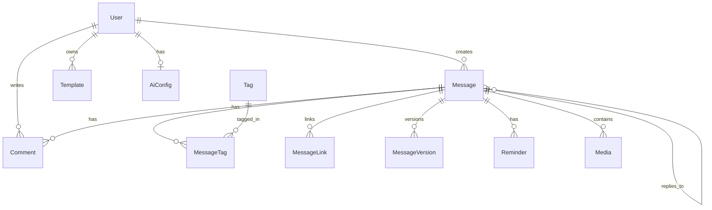

# WhiteNote 2.5 后端开发指南 - Stage 2: 数据库 Schema

> **前置文档**: [Stage 1: 项目初始化](file:///d:/Code/WhiteNote/docs/BACKEND_STAGE_01_INIT.md)  
> **下一步**: [Stage 3: 认证系统](file:///d:/Code/WhiteNote/docs/BACKEND_STAGE_03_AUTH.md)

---

## 目标

实现完整的 Prisma Schema，包含用户、消息、标签、双向链接、评论、模板、提醒等核心数据模型。

---

## Step 1: 编写完整 Prisma Schema

编辑 `prisma/schema.prisma`：

```prisma
// This is your Prisma schema file,
// learn more about it in the docs: https://pris.ly/d/prisma-schema

generator client {
  provider = "prisma-client-js"
}

datasource db {
  provider = "postgresql"
  url      = env("DATABASE_URL")
}

// ============================================
// 1. 用户模型 (多用户系统)
// ============================================
model User {
  id            String    @id @default(cuid())
  email         String    @unique
  passwordHash  String
  name          String?
  avatar        String?
  createdAt     DateTime  @default(now())
  updatedAt     DateTime  @updatedAt

  // NextAuth 适配器字段
  emailVerified DateTime?
  accounts      Account[]
  sessions      Session[]

  // 业务关系
  messages      Message[]
  comments      Comment[]
  templates     Template[]
  aiConfig      AiConfig?  // 每用户独立的 AI 配置
}

// ============================================
// 2. NextAuth 相关模型
// ============================================
model Account {
  id                String  @id @default(cuid())
  userId            String
  type              String
  provider          String
  providerAccountId String
  refresh_token     String? @db.Text
  access_token      String? @db.Text
  expires_at        Int?
  token_type        String?
  scope             String?
  id_token          String? @db.Text
  session_state     String?

  user User @relation(fields: [userId], references: [id], onDelete: Cascade)

  @@unique([provider, providerAccountId])
}

model Session {
  id           String   @id @default(cuid())
  sessionToken String   @unique
  userId       String
  expires      DateTime
  user         User     @relation(fields: [userId], references: [id], onDelete: Cascade)
}

model VerificationToken {
  identifier String
  token      String   @unique
  expires    DateTime

  @@unique([identifier, token])
}

// ============================================
// 3. 核心内容模型 - Message
// ============================================
model Message {
  id        String   @id @default(cuid())
  content   String   @db.Text
  createdAt DateTime @default(now())
  updatedAt DateTime @updatedAt

  // 收藏与置顶
  isStarred Boolean @default(false)
  isPinned  Boolean @default(false)

  // 作者关系
  author   User   @relation(fields: [authorId], references: [id], onDelete: Cascade)
  authorId String

  // Thread 模式 (串)
  parentId String?
  parent   Message?  @relation("Thread", fields: [parentId], references: [id], onDelete: SetNull)
  children Message[] @relation("Thread")

  // 标签系统
  tags MessageTag[]

  // 双向链接系统
  outgoingLinks MessageLink[] @relation("OutgoingLinks")
  incomingLinks MessageLink[] @relation("IncomingLinks")

  // 版本历史
  versions MessageVersion[]

  // 提醒
  reminders Reminder[]

  // 媒体与评论
  medias   Media[]
  comments Comment[]

  @@index([authorId])
  @@index([createdAt(sort: Desc)])
  @@index([isPinned, createdAt(sort: Desc)])
}

// ============================================
// 4. 标签系统
// ============================================
model Tag {
  id        String   @id @default(cuid())
  name      String   @unique
  color     String?
  createdAt DateTime @default(now())

  messages MessageTag[]

  @@index([name])
}

model MessageTag {
  message   Message @relation(fields: [messageId], references: [id], onDelete: Cascade)
  messageId String
  tag       Tag     @relation(fields: [tagId], references: [id], onDelete: Cascade)
  tagId     String

  @@id([messageId, tagId])
  @@index([tagId])
}

// ============================================
// 5. 双向链接系统
// ============================================
model MessageLink {
  id        String   @id @default(cuid())
  createdAt DateTime @default(now())

  sourceId String
  source   Message @relation("OutgoingLinks", fields: [sourceId], references: [id], onDelete: Cascade)

  targetId String
  target   Message @relation("IncomingLinks", fields: [targetId], references: [id], onDelete: Cascade)

  context String? // 链接上下文

  @@unique([sourceId, targetId])
  @@index([targetId])
}

// ============================================
// 6. 版本历史
// ============================================
model MessageVersion {
  id        String   @id @default(cuid())
  content   String   @db.Text
  createdAt DateTime @default(now())

  message   Message @relation(fields: [messageId], references: [id], onDelete: Cascade)
  messageId String

  @@index([messageId, createdAt(sort: Desc)])
}

// ============================================
// 7. 模板系统
// ============================================
model Template {
  id          String   @id @default(cuid())
  name        String
  content     String   @db.Text
  description String?
  isBuiltIn   Boolean  @default(false)
  createdAt   DateTime @default(now())
  updatedAt   DateTime @updatedAt

  author   User?   @relation(fields: [authorId], references: [id], onDelete: SetNull)
  authorId String?

  @@index([isBuiltIn])
}

// ============================================
// 8. 提醒系统
// ============================================
model Reminder {
  id          String   @id @default(cuid())
  remindAt    DateTime
  isCompleted Boolean  @default(false)
  repeatType  String?  // DAILY, WEEKLY, MONTHLY
  createdAt   DateTime @default(now())

  message   Message @relation(fields: [messageId], references: [id], onDelete: Cascade)
  messageId String

  @@index([remindAt, isCompleted])
}

// ============================================
// 9. 评论与 AI 回复
// ============================================
model Comment {
  id        String   @id @default(cuid())
  content   String   @db.Text
  createdAt DateTime @default(now())

  isAIBot Boolean @default(false)

  message   Message @relation(fields: [messageId], references: [id], onDelete: Cascade)
  messageId String

  author   User?   @relation(fields: [authorId], references: [id], onDelete: SetNull)
  authorId String?

  @@index([messageId, createdAt])
}

// ============================================
// 10. 媒体资源
// ============================================
model Media {
  id          String  @id @default(cuid())
  url         String
  type        String  // IMAGE, VIDEO, AUDIO
  description String? // AI 生成的描述

  message   Message @relation(fields: [messageId], references: [id], onDelete: Cascade)
  messageId String

  @@index([messageId])
}

// ============================================
// 11. AI 配置 (每用户独立)
// ============================================
model AiConfig {
  id String @id @default(cuid())

  // 用户关联 (多租户隔离)
  user     User   @relation(fields: [userId], references: [id], onDelete: Cascade)
  userId   String @unique  // 每个用户只有一条配置

  // 基础连接
  openaiBaseUrl String @default("http://localhost:4000")
  openaiApiKey  String @default("")
  openaiModel   String @default("gpt-3.5-turbo")

  // RAG 模式
  enableRag          Boolean   @default(false)
  ragflowBaseUrl     String    @default("http://localhost:4154")
  ragflowApiKey      String    @default("")
  ragflowChatId      String    @default("")
  ragflowDatasetId   String    @default("")
  ragTimeFilterStart DateTime?
  ragTimeFilterEnd   DateTime?

  // 自动化
  enableAutoTag  Boolean @default(true)
  enableBriefing Boolean @default(true)
  briefingTime   String  @default("08:00")

  // AI 人设
  aiPersonality String  @default("friendly")
  aiExpertise   String?

  // 链接建议
  enableLinkSuggestion Boolean @default(true)

  updatedAt DateTime @updatedAt
}

// ============================================
// 12. 搜索历史
// ============================================
model SearchHistory {
  id        String   @id @default(cuid())
  query     String
  createdAt DateTime @default(now())

  @@index([createdAt(sort: Desc)])
}
```

---

## Step 2: 运行数据库迁移

```bash
# 创建并应用迁移
pnpm prisma migrate dev --name init

# 生成 Prisma Client
pnpm prisma generate
```

---

## Step 3: 创建种子数据脚本

创建 `prisma/seed.ts`：

```typescript
import { PrismaClient } from '@prisma/client'
import { hash } from 'bcryptjs'

const prisma = new PrismaClient()

async function main() {
  // 1. 创建默认用户 (Owner)
  const passwordHash = await hash('admin123', 12)
  
  const owner = await prisma.user.upsert({
    where: { email: 'owner@whitenote.local' },
    update: {},
    create: {
      email: 'owner@whitenote.local',
      passwordHash,
      name: 'Owner',
    },
  })

  console.log('Created owner user:', owner.email)

  // 2. 为用户创建默认 AI 配置
  const aiConfig = await prisma.aiConfig.upsert({
    where: { userId: owner.id },
    update: {},
    create: {
      userId: owner.id,
      openaiBaseUrl: process.env.OPENAI_BASE_URL || 'http://localhost:4000',
      openaiApiKey: process.env.OPENAI_API_KEY || '',
      openaiModel: process.env.OPENAI_MODEL || 'gpt-3.5-turbo',
    },
  })

  console.log('Created AI config for user:', owner.email)

  // 3. 创建内置模板
  const templates = [
    {
      name: 'Daily Journal',
      description: '每日日记模板',
      content: `# 📅 ${new Date().toLocaleDateString('zh-CN')}

## 今日心情
<!-- 用 emoji 表达今天的心情 -->

## 今日待办
- [ ] 

## 今日收获
<!-- 今天学到了什么？ -->

## 明日计划
<!-- 明天要做什么？ -->
`,
      isBuiltIn: true,
    },
    {
      name: 'Quick Idea',
      description: '快速记录灵感',
      content: `💡 **灵感速记**

---

<!-- 快速记录你的想法 -->

`,
      isBuiltIn: true,
    },
  ]

  for (const template of templates) {
    await prisma.template.upsert({
      where: { id: template.name.toLowerCase().replace(/\s/g, '-') },
      update: template,
      create: {
        id: template.name.toLowerCase().replace(/\s/g, '-'),
        ...template,
      },
    })
  }

  console.log('Created built-in templates')
}

main()
  .catch((e) => {
    console.error(e)
    process.exit(1)
  })
  .finally(async () => {
    await prisma.$disconnect()
  })
```

---

## Step 4: 配置种子脚本

安装 bcryptjs 用于密码加密：

```bash
pnpm add bcryptjs
pnpm add -D @types/bcryptjs tsx
```

在 `package.json` 中添加：

```json
{
  "prisma": {
    "seed": "tsx prisma/seed.ts"
  }
}
```

运行种子脚本：

```bash
pnpm prisma db seed
```

---

## Step 5: 使用 Prisma Studio 验证

```bash
# 启动 Prisma Studio
pnpm prisma studio
```

访问 http://localhost:5555，确认：
- ✅ `User` 表有一条 owner 记录
- ✅ `AiConfig` 表有该用户的配置记录
- ✅ `Template` 表有两条内置模板

---

## 数据库关系图



---

## 验证检查点

```bash
# 1. 验证数据库连接
pnpm prisma db pull

# 2. 验证 Schema 语法
pnpm prisma validate

# 3. 查看数据库状态
pnpm prisma migrate status
```

---

## 下一步

完成数据库设计后，继续 [Stage 3: 认证系统](file:///d:/Code/WhiteNote/docs/BACKEND_STAGE_03_AUTH.md)。
